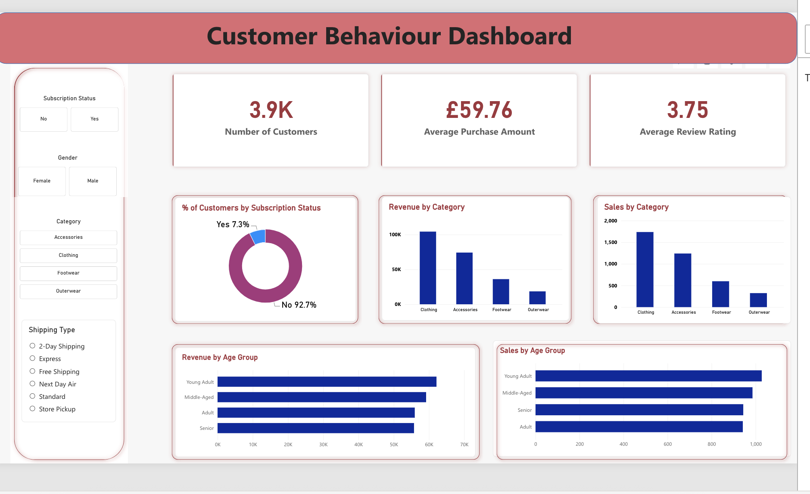
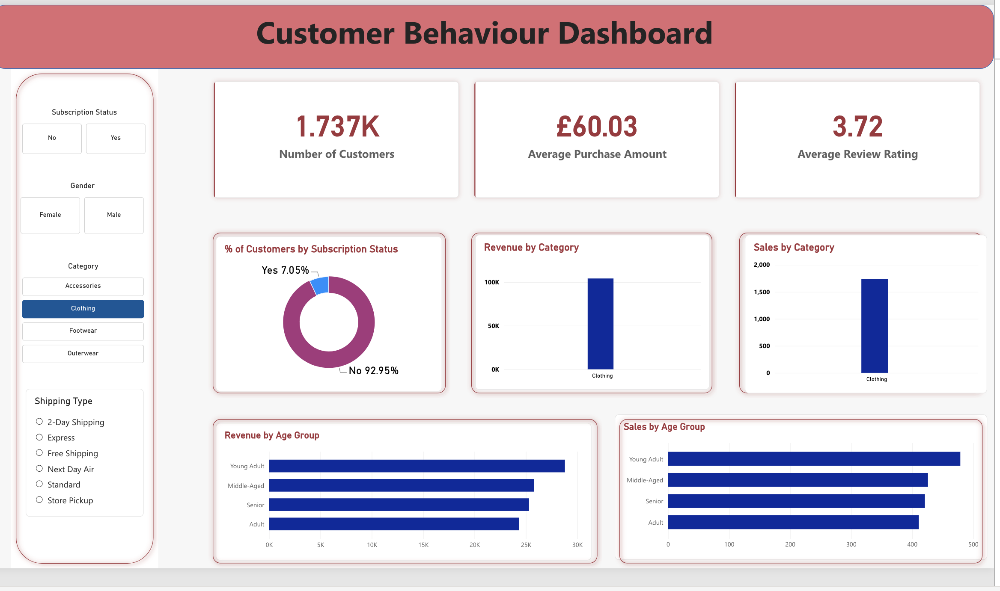

# Power BI Dashboard

## Overview

The Power BI dashboard was developed to turn the findings from the SQL analysis into an interactive business-facing report.

The dashboard focuses on customer behaviour, purchasing patterns and sales performance, allowing users to explore the data through interactive filters and visualisations.

## Dashboard Objectives

The dashboard was designed to:

- Provide an overview of customer purchasing behaviour
- Monitor key customer and sales KPIs
- Compare revenue and sales across product categories
- Analyse purchasing patterns across different age groups
- Explore customer subscription behaviour
- Allow users to interactively filter the analysis

## Key KPIs

The dashboard includes three headline KPIs:

- Number of Customers
- Average Purchase Amount
- Average Review Rating

These provide a high-level view of the customer base and purchasing behaviour before moving into the more detailed analysis.

## Visual Analysis

The dashboard includes:

- Percentage of customers by subscription status
- Revenue by category
- Sales by category
- Revenue by age group
- Sales by age group

Interactive filters allow the user to analyse these metrics by:

- Subscription status
- Gender
- Product category
- Shipping type

## Interactivity

The dashboard is designed to allow users to explore the data rather than simply view static results.

For example, selecting a specific product category dynamically updates the KPIs and visualisations across the report.

### Example: Clothing Category

When Clothing is selected:

- Customer count changes to 1.737K
- Average purchase amount changes to £60.03
- Average review rating changes to 3.72
- Revenue and sales visuals filter to Clothing
- Age-group analysis updates based on the selected category

This demonstrates how the dashboard can be used to explore customer behaviour at a more granular level.

## Relationship to SQL Analysis

The Power BI dashboard forms the visualisation stage of the project.

SQL was first used to analyse the underlying customer data and answer specific business questions relating to purchasing behaviour, products, discounts, shipping, customer segments and categories.

Power BI was then used to transform those findings into an interactive dashboard that makes the analysis easier to explore and communicate.

The overall workflow was:

**Raw Customer Data → SQL Analysis → Business Insights → Power BI Dashboard**

## Tools Used

- SQL
- Power BI
- DAX
- Power Query

## Dashboard Screenshots

### Dashboard Overview

### Interactive Category Filter

